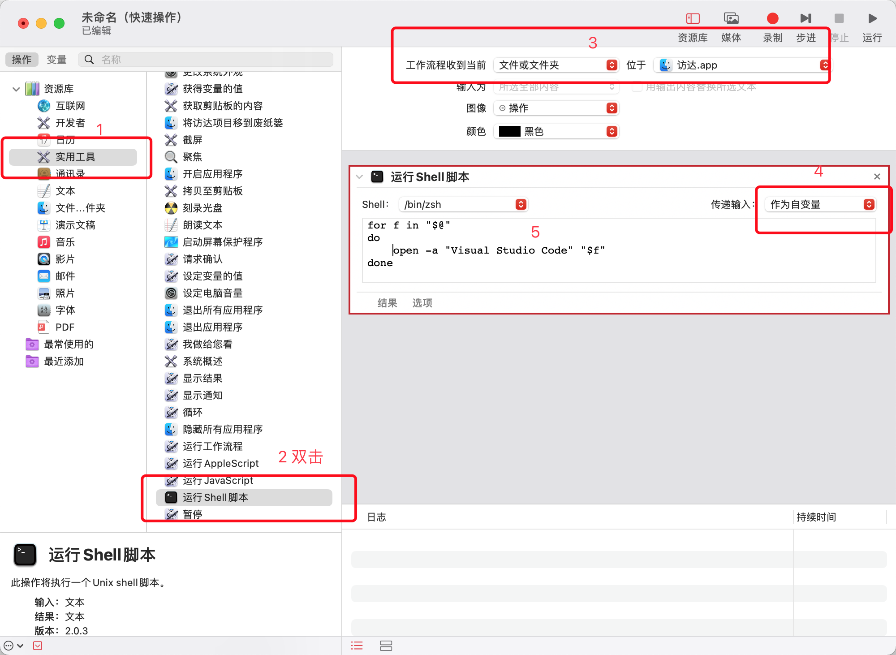

在 [VS Code](https://code.visualstudio.com/) 下载安装后，在终端中，`code .` 不能让 VS Code 打开当前目录。有以下几种解决办法：

## 使用 VS Code 自带的命令

打开 VS Code，使用快捷键 `cmd+shift+p` 或菜单栏点击 `查看-命令面板`，打开命令面板，输入 `shell`，选择 `在PATH中安装"code"命令`。按照提示输入密码即可。立即生效。

> **这种方法会创建多个实例，即程序坞中出现多个 VS Code 的图标**

## 把 code 可执行文件所在目录添加到 PATH 中

在 `~/.zshrc` 或 `~/.zprofile` 文件中添加以下内容

```shell
# Add Visual Studio Code (code)
export PATH="$PATH:/Applications/Visual Studio Code.app/Contents/Resources/app/bin"
```

在已打开的终端中 `source` 配置文件后，立即生效。或者新开终端立即生效。

> **这种方法会创建多个实例，即程序坞中出现多个 VS Code 的图标**

## alias code 可执行文件 (不推荐)

在 `~/.zshrc` 或 `~/.zprofile` 文件中添加以下内容

```shell
alias code="/Applications/Visual\ Studio\ Code.app/contents/Resources/app/bin/code"
```

在已打开的终端中 `source` 配置文件后，立即生效。或者新开终端立即生效。

> **这种方法会创建多个实例，即程序坞中出现多个 VS Code 的图标**

## alias 打开 VS Code 的命令

在 `~/.zshrc` 或 `~/.zprofile` 文件中添加以下内容

```shell
alias code='open -a "Visual Studio Code"'
# or
# code () { VSCODE_CWD="$PWD" open -n -b "com.microsoft.VSCode" --args $* }
```

在已打开的终端中 `source` 配置文件后，立即生效。或者新开终端立即生效。

> **这种方法不会创建多个实例，即程序坞中只会有一个 VS Code 的图标**

## 总结

如果想要在终端每次 `code` 打开 `VS Code` 窗口，都要在程序坞另外加一个图标，则可以使用第一种或第二种方法。

如果想要保持 `VS Code` 的多个窗口，始终保持在程序坞种的一个图标内，则使用第四种方法。

特别说明：在 `VS Code` 中的菜单上点击 `文件-新建窗口` 或快捷键 `cmd+shift+n` 新建窗口时，都会始终保持在程序坞的一个图标内。所以为了保持一致的行为，建议选择第四种方法，始终保持程序坞中只有一个 `VS Code` 的图标。

---

## 右键菜单添加使用 VS Code 打开

访达中的右键菜单添加 `使用VS Code打开` 的菜单项。

1. `command+space` 打开全局搜索，输入 “自动操作”，打开 `自动操作` 应用。
1. 新建 `快速操作`。
1. 按照下图所示配置：
   
1. 配置完成后，保存为 “使用 VS Code” 打开。
